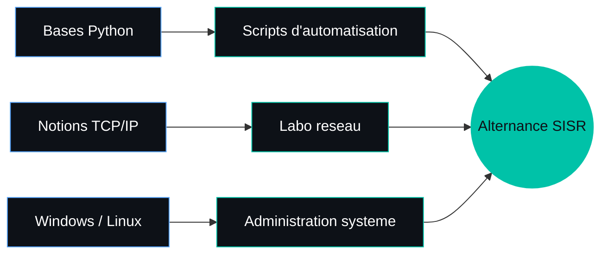

<h1 align="center">Myriam Khorchani</h1>

<p align="center">
  Étudiante en BTS SIO option SISR · Angers<br>
  Recherche d'une alternance en systèmes et réseaux
</p>

<p align="center">
  
  
  
</p>

---

## Profil

```bash
myriam@angers:~$ whoami
Myriam Khorchani

myriam@angers:~$ cat profil.txt
formation   : BTS SIO option SISR, My Digital School (Angers)
objectif    : alternance, technicien systemes et reseaux
rythme      : 1 semaine ecole / 1 semaine entreprise
mobilite    : Angers et alentours
statut      : disponible
```

Je me forme aux métiers des systèmes et réseaux : support aux utilisateurs, gestion de parc informatique, bases du réseau. J'ai découvert le terrain lors de deux stages dans des services informatiques, et je poursuis ma montée en compétences en autonomie.

---

## Compétences

### Systèmes


### Réseaux


### Programmation


### Détail par domaine

| Domaine | Ce que je sais faire | Niveau |
|---|---|---|
| Support utilisateurs | Accueillir et traiter les demandes, dépanner au quotidien | Pratiqué en stage |
| Gestion de parc | Suivi des postes et du matériel | Pratiqué en stage |
| Windows | Utilisation et prise en main de l'environnement | Prise en main |
| Linux | Utilisation et prise en main de l'environnement | Prise en main |
| Réseaux | Modèle TCP/IP, notions de base | Notions |
| Python | Bases du langage via un MOOC (Rebond Sup / FUN MOOC) | En cours |

### Savoir-être


---

## Parcours

| Période | Cursus | Établissement |
|---|---|---|
| 2026 - | BTS SIO option SISR | My Digital School, Angers |
| 2025 - 2026 | Licence PluriPASS | Université d'Angers |
| 2025 | Baccalauréat général (Maths, HGGSP) | - |

---

## Expériences en informatique

### Stage, service informatique de l'Université d'Angers
```text
Missions : support aux utilisateurs
           découverte du parc informatique et du réseau
```

### Stage, service informatique de la mairie de Saumur (2025)
```text
Missions : gestion du parc informatique
           suivi des postes et du matériel
```

---

## Auto-formation

```bash
$ ls ~/formation
python/          # MOOC Rebond Sup / FUN MOOC (en cours)
reseaux-tcpip/   # notions de base
windows-linux/   # prise en main des deux environnements
```

---

## Axes de progression



---

## Projets

<!-- Ajoute ici tes vrais dépôts quand ils existent, un par ligne : -->
<!-- - [Nom du projet](lien) : ce que ça fait en une phrase -->

Projets en préparation, dépôts à venir.

---

## Contact

```bash
$ contact --me
LinkedIn : ton-lien
Email    : ton@email
```

[](ton-lien)
[](mailto:ton@email)
